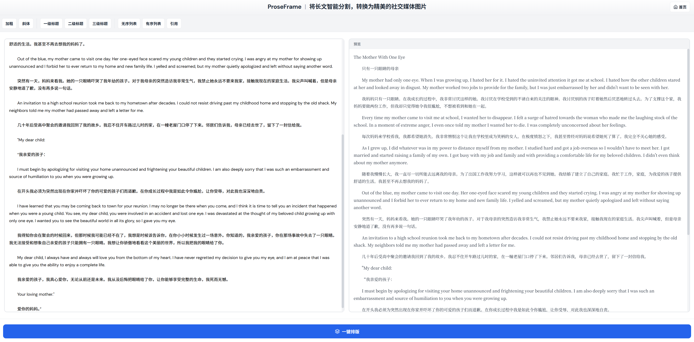
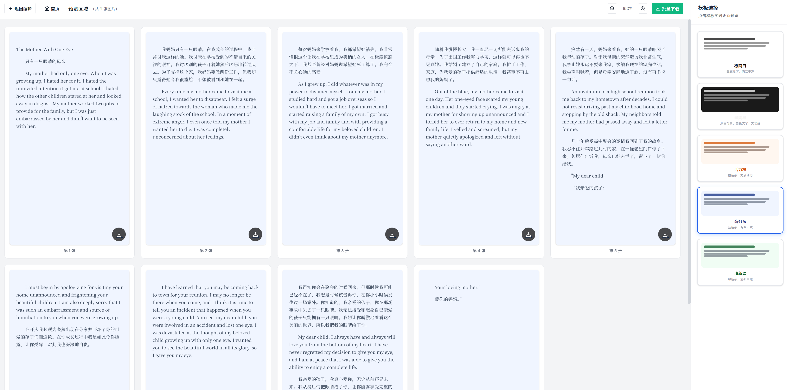

# ProseFrame

长文智能排版工具 — 将文章内容自动分割为精美的社交媒体图片，支持多模板、一键导出。

## 功能特点

- **智能分页**：长文自动分割成适合阅读的图片，无需手动处理
- **多模板选择**：提供极简、商务、活力等多种风格模板
- **一键导出**：批量下载为高清 PNG 图片
- **Markdown 支持**：支持 Markdown 格式输入，实时预览

## 界面预览

### 首页


### 编辑页面


### 预览与导出


## 技术栈

- React 19
- Vite
- html2canvas
- React Markdown

## 本地运行

```bash
npm install
npm run dev
```

## 使用说明

1. 访问应用首页，点击「开始创作」
2. 在左侧编辑器中输入或粘贴文章内容（支持 Markdown）
3. 点击「一键排版」生成图片
4. 在右侧预览区域选择模板、缩放查看
5. 点击「批量下载」导出所有图片

---
Made with care for beautiful typography.
